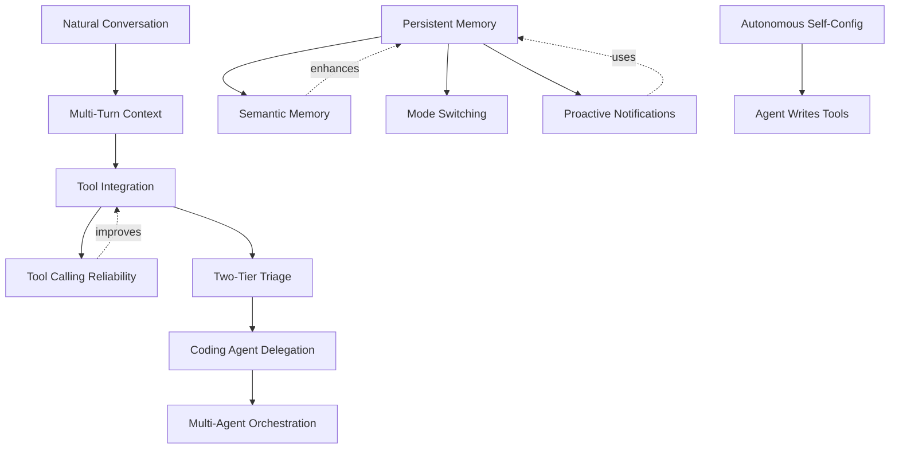

# Feature Landscape: Self-Hosted Personal AI Assistants

**Domain:** Single-user self-hosted personal AI assistant accessed via Telegram
**Researched:** 2026-02-05
**Confidence:** HIGH (based on analysis of OpenClaw, multiple commercial assistants, and 2026 ecosystem trends)

## Executive Summary

The personal AI assistant market in 2026 has matured rapidly, with self-hosted solutions like [OpenClaw gaining 117K+ GitHub stars](https://medium.com/@ilanpoonjolai/moltbot-formerly-clawdbot-101-the-viral-self-hosted-ai-assistant-that-lives-in-your-chats-47000580e320) and the [global market hitting $42 billion](https://www.marketsandmarkets.com/Market-Reports/ai-assistant-market-40111511.html). The ecosystem has converged on clear table stakes: [multi-platform integration, persistent memory, and natural conversation](https://reclaim.ai/blog/ai-assistant-apps). The most significant differentiator for self-hosted solutions is **deep system access with privacy guarantees** — the ability to [access filesystem, browser, email, and smart home while keeping data local](https://medium.com/@gemQueenx/clawdbot-ai-the-revolutionary-open-source-personal-assistant-transforming-productivity-in-2026-6ec5fdb3084f).

Single-user self-hosted assistants occupy a unique position: they can assume total control without multi-tenancy constraints, enabling aggressive self-configuration and system-level automation that cloud services cannot provide.

---

## Table Stakes

Features users expect from any personal AI assistant in 2026. Missing these makes the product feel incomplete or dated.

| Feature | Why Expected | Complexity | Implementation Notes |
|---------|--------------|------------|---------------------|
| **Natural Conversation** | [99.5% speech recognition accuracy is now baseline](https://www.imd.org/ibyimd/artificial-intelligence/2026-ai-trends-what-leaders-need-to-know-to-stay-competitive/); users expect to ask questions naturally without learning commands | Low | ✅ Already have: LLM handles this via triage/smart delegation |
| **Multi-Turn Context** | [Engineers can push assistants into longer conversations, switching topics while still being understood](https://www.getguru.com/reference/ai-assistant) | Low | ✅ Already have: Smart agent maintains chat history in session |
| **Tool Integration (Gmail, Calendar, Tasks)** | [Context access is the factor that matters most in 2026](https://www.imd.org/ibyimd/artificial-intelligence/2026-ai-trends-what-leaders-need-to-know-to-stay-competitive/); assistants without real-world tool access feel like toys | Medium | ✅ Already have: Gmail, Linear, Notion integrations |
| **Tool Calling Reliability** | [Tool execution complexity is the most common engineering failure point](https://composio.dev/blog/best-ai-agent-builders-and-integrations); [auth, rate limits, compliance logging separate prototypes from production](https://composio.dev/blog/ai-agent-tool-calling-guide) | High | ⚠️ Partial: Have tool execution but no retry logic, rate limit handling, or credential rotation |
| **Persistent Memory** | [Users save 8-15 hours weekly when AI remembers context](https://plurality.network/blogs/ai-long-term-memory-with-ai-context-flow/); forgetting past conversations is unacceptable | High | ❌ Missing: Sessions lost on restart, no long-term memory storage |
| **Fast Response Times** | [Sub-100ms latency becoming expected for voice interfaces](https://www.imd.org/ibyimd/artificial-intelligence/2026-ai-trends-what-leaders-need-to-know-to-stay-competitive/); for text, <2s feels instant | Low | ✅ Already have: Triage model provides fast responses |
| **Mode/Context Switching** | [Context loss causes 40% productivity drop when switching tools](https://plurality.network/blogs/universal-ai-context-to-switch-ai-tools/); users expect work/personal separation | Medium | ✅ Already have: `/mode` command switches configs |
| **Error Graceful Degradation** | Users expect clear error messages and partial functionality when services fail | Medium | ✅ Already have: Integrations disable gracefully, errors surfaced to user |
| **Status Awareness** | Users need to know if the assistant is "thinking," "waiting," or "done" | Low | ✅ Already have: Status reporter broadcasts session updates |

### Dependencies
```
Natural Conversation → Multi-Turn Context (requires conversation history)
Tool Integration → Tool Calling Reliability (tools must execute successfully)
Persistent Memory → Mode/Context Switching (modes need to persist across sessions)
```

---

## Differentiators

Features that set a self-hosted personal assistant apart from commercial alternatives. Not expected, but highly valued by target users.

| Feature | Value Proposition | Complexity | Implementation Notes |
|---------|-------------------|------------|---------------------|
| **Two-Tier Triage/Delegation** | Reduces costs by 80-90% vs. always-smart routing while maintaining quality; [cheap models handle 60-70% of queries](https://learn.microsoft.com/en-us/azure/architecture/ai-ml/guide/ai-agent-design-patterns) | Medium | ✅ Already have: Haiku triage → Opus/Sonnet delegation |
| **Autonomous Self-Configuration** | [Agents modify their own code, install skills, debug across machines](https://medium.com/@gemQueenx/what-is-openclaw-open-source-ai-agent-in-2026-setup-features-8e020db20e5e); reduces manual config burden | High | ❌ Missing: Agent can't read/write own config yet |
| **Coding Agent Delegation** | [Developers delegate 0-20% of tasks fully but use AI in 60% of work](https://www.adwaitx.com/anthropic-2026-agentic-coding-trends-ai-agents/); specialized coding agent handles dev work better than general assistant | High | 🔄 Planned: pi-coding-agent integration |
| **Privacy-First Self-Hosted** | [Memory, message history, files stay on your hardware with no third-party training](https://medium.com/@gemQueenx/clawdbot-ai-the-revolutionary-open-source-personal-assistant-transforming-productivity-in-2026-6ec5fdb3084f) | Low | ✅ Already have: Runs on user's VPS, no data sharing |
| **Deep System Access** | [Unlike ChatGPT, can access filesystem, browser, email, smart home](https://medium.com/@gemQueenx/clawdbot-ai-the-revolutionary-open-source-personal-assistant-transforming-productivity-in-2026-6ec5fdb3084f); enables real automation | Medium-High | ⚠️ Partial: Have Gmail/Linear/Notion, no filesystem/browser yet |
| **Semantic Memory Search** | [RAG with vector DB enables semantic retrieval of past conversations and documents](https://www.techment.com/blogs/rag-in-2026-enterprise-ai/) faster than keyword search | High | ❌ Missing: No vector DB, no semantic search |
| **Proactive Notifications** | [Sends reminders based on traffic conditions, delivers morning briefings](https://medium.com/@gemQueenx/clawdbot-ai-the-revolutionary-open-source-personal-assistant-transforming-productivity-in-2026-6ec5fdb3084f); agent reaches out rather than waiting | Medium | ⚠️ Partial: Have cron jobs but no context-aware triggers |
| **Multi-Agent Orchestration** | [Specialized agents collaborating on complex workflows is the real transformation](https://www.techradar.com/pro/five-ai-agent-predictions-for-2026-the-year-enterprises-stop-waiting-and-start-winning), not just single-task automation | High | 🔄 Planned: Coding agent is first step toward multi-agent |
| **Agent Writes Its Own Tools** | [Moltbot builds new skills for itself based on needs](https://medium.com/@gemQueenx/what-is-openclaw-open-source-ai-agent-in-2026-setup-features-8e020db20e5e); ultimate customization | Very High | ❌ Out of scope: Extremely complex, security risks |

### Dependencies
```
Two-Tier Triage → Tool Integration (delegation needs tools to execute)
Coding Agent Delegation → Multi-Agent Orchestration (coding agent is specialized sub-agent)
Semantic Memory → Persistent Memory (need storage layer first)
Proactive Notifications → Persistent Memory (need to recall context for triggers)
Agent Writes Tools → Autonomous Self-Configuration (self-modifying code foundation)
```

---

## Anti-Features

Features to explicitly NOT build. Common mistakes or feature creep that harms the product.

| Anti-Feature | Why Avoid | What to Do Instead |
|--------------|-----------|-------------------|
| **Super-Agent with Every Tool** | [Creating ONE "super agent" with every possible tool is a critical mistake](https://www.langflow.org/blog/top-three-mistakes-building-agents); impossible to maintain, confusing delegation | Use [specialized agents for specific tasks](https://learn.microsoft.com/en-us/azure/architecture/ai-ml/guide/ai-agent-design-patterns) — coding agent, email agent, research agent |
| **Web UI Dashboard** | Adds maintenance burden, contradicts "Telegram is the interface" philosophy | Telegram handles all interaction; status via `/sessions` command |
| **Multi-User Support** | [Multi-tenancy requires credential management for thousands of users, auth complexity](https://composio.dev/blog/ai-agent-tool-calling-guide) | Single-user design allows aggressive assumptions (one set of creds, one filesystem) |
| **Voice Interface** | [Voice requires 99.5% accuracy with sub-100ms latency](https://www.imd.org/ibyimd/artificial-intelligence/2026-ai-trends-what-layers-need-to-know-to-stay-competitive/); adds complexity without value for text-first workflow | Telegram voice messages can be transcribed by LLM if needed |
| **Built-in RAG for All Documents** | [Vector DB market exploded but contextual/agentic memory surpassing RAG for many use cases](https://venturebeat.com/data/six-data-shifts-that-will-shape-enterprise-ai-in-2026/) | Integrate with Exa web search for external knowledge; persistent memory for personal context |
| **MCP Server Support** | [Pi-mono philosophy: agent extends itself, no external tool registries](https://medium.com/@gemQueenx/what-is-openclaw-open-source-ai-agent-in-2026-setup-features-8e020db20e5e); MCP adds abstraction layer with unclear benefit | Write integrations directly as TypeScript packages |
| **Unlimited Context Windows** | [Quality of data matters more than quantity](https://www.applaudhr.com/blog/artificial-intelligence/5-common-mistakes-to-avoid-when-implementing-ai-in-hr); long contexts cause hallucinations | Summarize and extract key points; semantic search for retrieval |
| **"AI Will Solve Everything" Expectations** | [Expecting AI to solve all problems instantly or operate flawlessly from day one causes disappointment](https://www.applaudhr.com/blog/artificial-intelligence/5-common-mistakes-to-avoid-when-implementing-ai-in-hr) | Set clear boundaries: [explicit permission to say "I don't know" prevents hallucinations](https://github.com/danielmiessler/Personal_AI_Infrastructure) |
| **Always-On Proactive Agent** | Risks becoming annoying spam; [speed can replace command judgment](https://warontherocks.com/2026/01/the-triage-trap-when-ai-speed-replaces-command-judgment/) | Proactive only for high-signal triggers (calendar, cron); otherwise reactive |

### Key Design Principle
> [AI is probabilistic; your infrastructure shouldn't be. If you can solve it with a bash script, don't use AI.](https://github.com/danielmiessler/Personal_AI_Infrastructure)

---

## Feature Complexity Analysis

Complexity is a function of: (1) technical implementation difficulty, (2) testing/reliability burden, (3) maintenance/evolution cost.

### Low Complexity (1-3 days)
- Natural conversation (LLM handles)
- Fast response times (model selection)
- Status awareness (polling + broadcasts)
- Privacy-first self-hosted (deployment model)

### Medium Complexity (1-2 weeks)
- Multi-turn context (session management)
- Mode/context switching (config system)
- Error graceful degradation (try/catch + fallbacks)
- Two-tier triage/delegation (routing logic)
- Proactive notifications (cron + context checks)
- Deep system access - basic (filesystem tools)

### High Complexity (3-6 weeks)
- Tool integration (OAuth, SDKs, error handling)
- **Tool calling reliability (auth, rate limits, retries)** ← Highest risk area
- Persistent memory (storage layer + retrieval)
- Autonomous self-configuration (config read/write + validation)
- Coding agent delegation (pi-coding-agent integration)
- Semantic memory search (vector DB + embeddings)
- Multi-agent orchestration (coordinator pattern)

### Very High Complexity (2-3 months)
- Deep system access - advanced (browser automation, smart home)
- Agent writes its own tools (code generation + sandboxing + security)

### Complexity vs. Value Matrix

**High Value, Low/Medium Complexity (do first):**
- Two-tier triage/delegation ✅
- Persistent memory (JSON files, not vector DB)
- Autonomous self-configuration
- Proactive notifications (cron-based)

**High Value, High Complexity (defer but plan):**
- Tool calling reliability improvements
- Semantic memory search
- Multi-agent orchestration

**Low Value, High Complexity (avoid):**
- Agent writes its own tools
- Always-on proactive agent
- Web UI dashboard

---

## MVP Recommendation

For the **Jarvis** project (Telegram-based self-hosted assistant), prioritize this order:

### Phase 1: Foundation (Table Stakes)
1. ✅ **Two-tier triage/delegation** — already working
2. ✅ **Tool integration (Gmail, Linear, Notion)** — already working
3. ❌ **Persistent memory (simple JSON storage)** — agent can store/retrieve preferences
4. ❌ **Tool calling reliability** — retry logic, better error messages, rate limit awareness

### Phase 2: Differentiation
5. ❌ **Autonomous self-configuration** — agent reads/writes its own config
6. ❌ **Coding agent delegation** — integrate pi-coding-agent
7. ❌ **Mode switching via Telegram** — `/mode work` command
8. ❌ **Exa web search** — external knowledge without RAG complexity

### Phase 3: Advanced (Post-MVP)
9. ❌ **Semantic memory search** — vector DB for conversation history (only if JSON storage insufficient)
10. ❌ **Multi-agent orchestration** — coordinator pattern for specialized agents
11. ❌ **Deep system access** — filesystem, browser tools (security-hardened)

### Defer Indefinitely
- Agent writes its own tools (security nightmare)
- Web UI (contradicts design philosophy)
- Multi-user support (not target use case)
- Voice interface (text-first workflow)
- MCP support (pi-mono philosophy)

---

## Critical Dependencies

Features must be built in this order due to hard dependencies:



**Legend:**
- Solid arrows: Hard dependency (must build A before B)
- Dotted arrows: Soft dependency (B improves A but not required)

---

## Sources

### Self-Hosted AI Assistants
- [Clawdbot AI: The Revolutionary Open-Source Personal Assistant Transforming Productivity in 2026](https://medium.com/@gemQueenx/clawdbot-ai-the-revolutionary-open-source-personal-assistant-transforming-productivity-in-2026-6ec5fdb3084f)
- [What is OpenClaw: Open-Source AI Agent in 2026 (Setup + Features)](https://medium.com/@gemQueenx/what-is-openclaw-open-source-ai-agent-in-2026-setup-features-8e020db20e5e)
- [Moltbot (formerly Clawdbot) 101: the viral self-hosted AI assistant](https://medium.com/@ilanpoonjolai/moltbot-formerly-clawdbot-101-the-viral-self-hosted-ai-assistant-that-lives-in-your-chats-47000580e320)
- [Introducing Moltworker: a self-hosted personal AI agent](https://blog.cloudflare.com/moltworker-self-hosted-ai-agent/)

### AI Agent Architecture & Triage Models
- [Multi-Agent AI Systems: The Complete Enterprise Guide for 2026](https://neomanex.com/posts/multi-agent-ai-systems-orchestration)
- [AI Agent Orchestration Patterns - Azure Architecture Center](https://learn.microsoft.com/en-us/azure/architecture/ai-ml/guide/ai-agent-design-patterns)
- [A Complete Guide to AI Agent Architecture in 2026](https://www.lindy.ai/blog/ai-agent-architecture)
- [The 2026 Guide to AI Agent Architecture Components](https://procreator.design/blog/guide-to-ai-agent-architecture-components/)

### Persistent Memory & Context
- [Clawdbot: The Personal AI Assistant That Siri Should Have Been](https://zoopa.es/en/blog/clawdbot-the-personal-ai-assistant-that-siri-should-have-been-complete-guide-2026/)
- [Universal AI Long-Term Memory: Never Repeat Yourself](https://plurality.network/blogs/ai-long-term-memory-with-ai-context-flow/)
- [Stop Losing Context When Switching AI Platforms (2026)](https://plurality.network/blogs/universal-ai-context-to-switch-ai-tools/)
- [Best AI Memory Extensions of 2026](https://plurality.network/blogs/best-universal-ai-memory-extensions-2026/)

### Tool Integrations & Calling
- [Tool Calling Explained: The Core of AI Agents (2026 Guide)](https://composio.dev/blog/ai-agent-tool-calling-guide)
- [The 2026 Guide to AI Agent Builders (And Why They All Need an Action Layer)](https://composio.dev/blog/best-ai-agent-builders-and-integrations)
- [Notion AI Connectors Explained: Supercharge Your Toolstack](https://kipwise.com/blog/notion-ai-connectors-explained)
- [15 Best AI Assistants for Email Productivity in 2026](https://gmelius.com/blog/best-ai-assistants-for-email)

### Table Stakes & Market Trends
- [2026 AI trends - Staying Competitive](https://www.imd.org/ibyimd/artificial-intelligence/2026-ai-trends-what-leaders-need-to-know-to-stay-competitive/)
- [AI Assistant Market Size | Share, Trends & Revenue Forecast](https://www.marketsandmarkets.com/Market-Reports/ai-assistant-market-40111511.html)
- [16 Best AI Assistant Apps for 2026](https://reclaim.ai/blog/ai-assistant-apps)
- [AI Assistant: 2026 Ultimate Guide - Definition, Examples & More](https://www.getguru.com/reference/ai-assistant)

### Coding Agents
- [Anthropic Unveils 2026 AI Coding Report: 8 Trends Reshape Software Development](https://www.adwaitx.com/anthropic-2026-agentic-coding-trends-ai-agents/)
- [Cline Review (2026): Autonomous AI Coding Agent for VS Code](https://vibecoding.app/blog/cline-review-2026)
- [Top 7 AI Coding Agents for 2026: Tested & Ranked](https://www.lindy.ai/blog/ai-coding-agents)

### Anti-Patterns & Pitfalls
- [Top 3 Mistakes I Made While Building AI Agents](https://www.langflow.org/blog/top-three-mistakes-building-agents)
- [5 Common Mistakes to Avoid When Implementing AI Assistants](https://www.applaudhr.com/blog/artificial-intelligence/5-common-mistakes-to-avoid-when-implementing-ai-in-hr)
- [Personal AI Infrastructure - Agentic AI Infrastructure for HUMAN capabilities](https://github.com/danielmiessler/Personal_AI_Infrastructure)
- [The Triage Trap: When AI Speed Replaces Command Judgment](https://warontherocks.com/2026/01/the-triage-trap-when-ai-speed-replaces-command-judgment/)

### Vector Databases & Semantic Memory
- [RAG in 2026: How Retrieval-Augmented Generation Works for Enterprise AI](https://www.techment.com/blogs/rag-in-2026-enterprise-ai/)
- [6 data predictions for 2026: RAG is dead, what's old is new again](https://venturebeat.com/data/six-data-shifts-that-will-shape-enterprise-ai-in-2026)
- [How Do Vector Databases Power Agentic AI's Memory](https://www.getmonetizely.com/articles/how-do-vector-databases-power-agentic-ais-memory-and-knowledge-systems)

### Proactive Agents & Scheduling
- [10 Best AI Assistants in 2026](https://www.morgen.so/blog-posts/best-ai-planning-assistants)
- [I Tested the Top 10 AI Scheduling Assistants in 2026](https://www.lindy.ai/blog/ai-scheduling-assistant)
- [Top 10 AI Personal Assistants to Help You Ease Your Life [2026]](https://www.lindy.ai/blog/ai-personal-assistant)

### Multi-Agent & Enterprise
- [Five AI agent predictions for 2026: The year enterprises stop waiting](https://www.techradar.com/pro/five-ai-agent-predictions-for-2026-the-year-enterprises-stop-waiting-and-start-winning)
- [AI Agent Orchestration in 2026: Coordination, Scale and Strategy](https://kanerika.com/blogs/ai-agent-orchestration/)

---

*Feature research completed: 2026-02-05*
